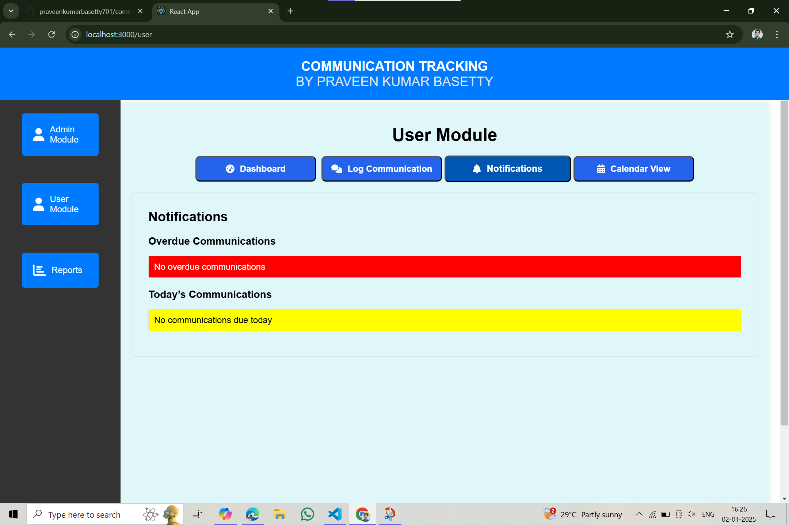

## Calendar Application for Communication Tracking

## Project Description 
The Calendar Application for Communication Tracking is designed to help users manage and track their communication activities efficiently. Whether you're managing a team, coordinating with clients, or simply keeping track of personal communications, this app provides an intuitive interface and powerful features to keep you organized. 
## Features 
- User Management: Create, edit, and delete user profiles.
- Communication Methods: Add and manage various communication methods like email, phone, and chat. - Reports: Generate detailed reports on communication frequency and effectiveness.
- Notifications: Receive notifications for important communication activities.
- Dashboard: View a summary of all communication activities in one place.
## Installation and Setup ### Prerequisites

- Node.js: Ensure you have Node.js installed. You can download it from the [Node.js official website](https://nodejs.org/).
- 
## Installation and Setup

To get started with the Communication Tracking App, follow these steps:

## Prerequisites

- **Node.js**: Ensure you have Node.js installed. You can download it from [Node.js official website](https://nodejs.org/).

## Installation

1. **Clone the Repository**:
   ```bash
   git clone https://github.com/praveenkumarbasetty701/communication-tracking-app-new.git
   cd communication-tracking-app-new
2. **Install Dependencies**:
npm install
3. **Run the App**:
npm start
## Setup 
1. **Environment Variables**:
Create a .env file in the root directory.
Add the following environment variables:
REACT_APP_API_KEY=your-api-key
REACT_APP_AUTH_DOMAIN=your-auth-domain
REACT_APP_PROJECT_ID=your-project-id
REACT_APP_STORAGE_BUCKET=your-storage-bucket
REACT_APP_MESSAGING_SENDER_ID=your-messaging-sender-id
REACT_APP_APP_ID=your-app-id

2. **Firebase Configuration**:
Ensure you have a Firebase project set up.
Update the firebase.js file with your Firebase configuration.

## Usage

1. **User Login**:
Navigate to the login page and enter your credentials to log in.

2. **Dashboard**:
View a summary of all your communication activities on the dashboard.

3. **Add Communication Method**:
Go to the communication methods section and add a new method (e.g., email, phone).

4. **Generate Reports**:
Navigate to the reports section and generate detailed reports on your communication activities.

## Screenshots

### Figure 1: Dashboard

*Figure 1: Dashboard*

### Figure 2: Add Communication Method

*Figure 2: Add Communication Method*

### Figure 3: User Management

*Figure 3: User Management*

### Figure 4: Admin Module

*Figure 4: Admin Module*

### Figure 5: Calendar View

*Figure 5: Calendar View*

### Figure 6: Communication Frequency

*Figure 6: Communication Frequency*

### Figure 7: Company Management

*Figure 7: Company Management*

### Figure 8: Log Communication

*Figure 8: Log Communication*

### Figure 9: Notification

*Figure 9: Notification*

### Figure 10: Reports Module

*Figure 10: Reports Module*

### Figure 11: View Reports

*Figure 11: View Reports*


## Dependencies
The Communication Tracking App relies on the following dependencies:

1. React: A JavaScript library for building user interfaces.

2. Firebase: A platform developed by Google for creating mobile and web applications.

3. React Router: A standard library for routing in React.

4. Axios: A promise-based HTTP client for the browser and Node.js.

**To install all dependencies, simply run**:
npm install

## Contributing
We welcome contributions! Please see our CONTRIBUTING.md for details on how to get started.

## License
This project is licensed under the MIT License - see the LICENSE file for details.       
